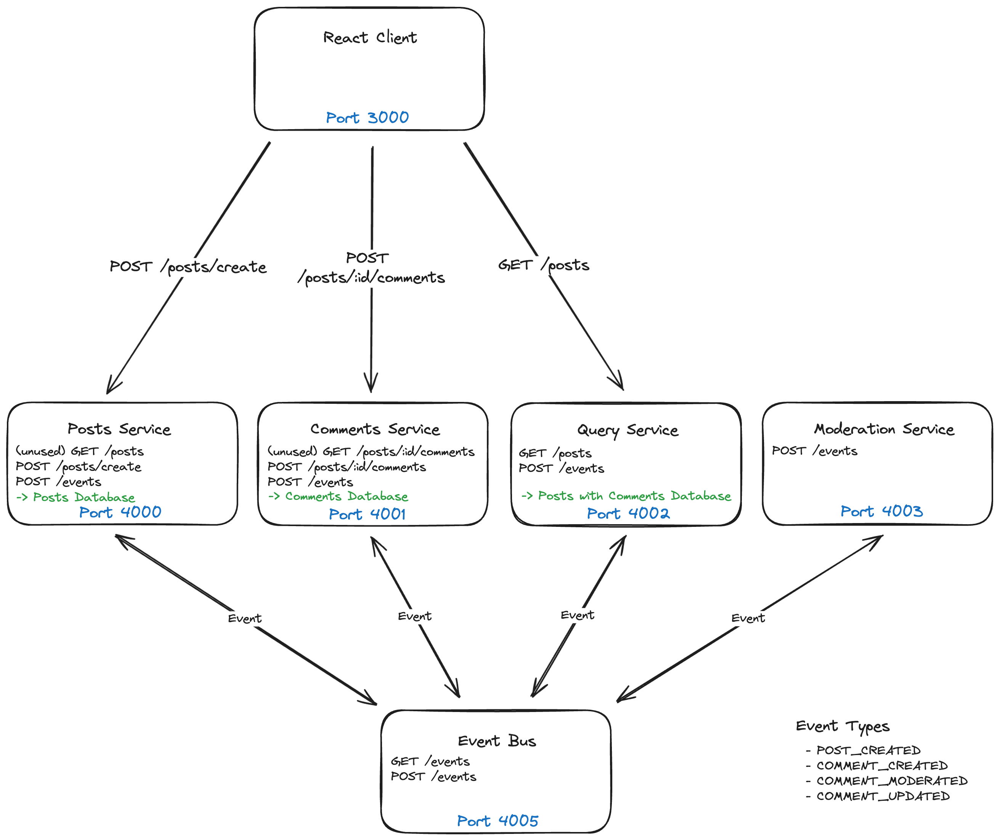
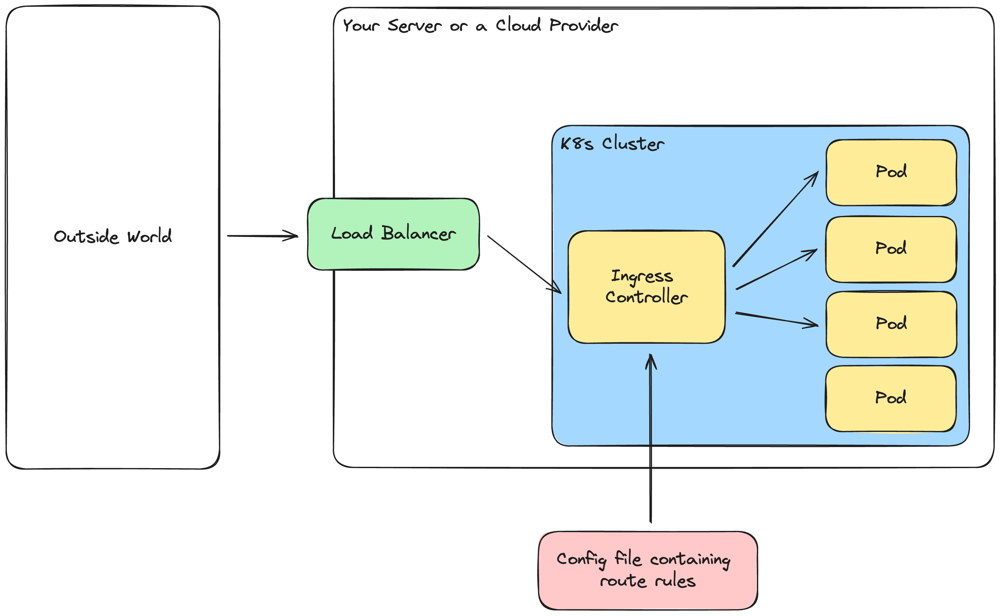
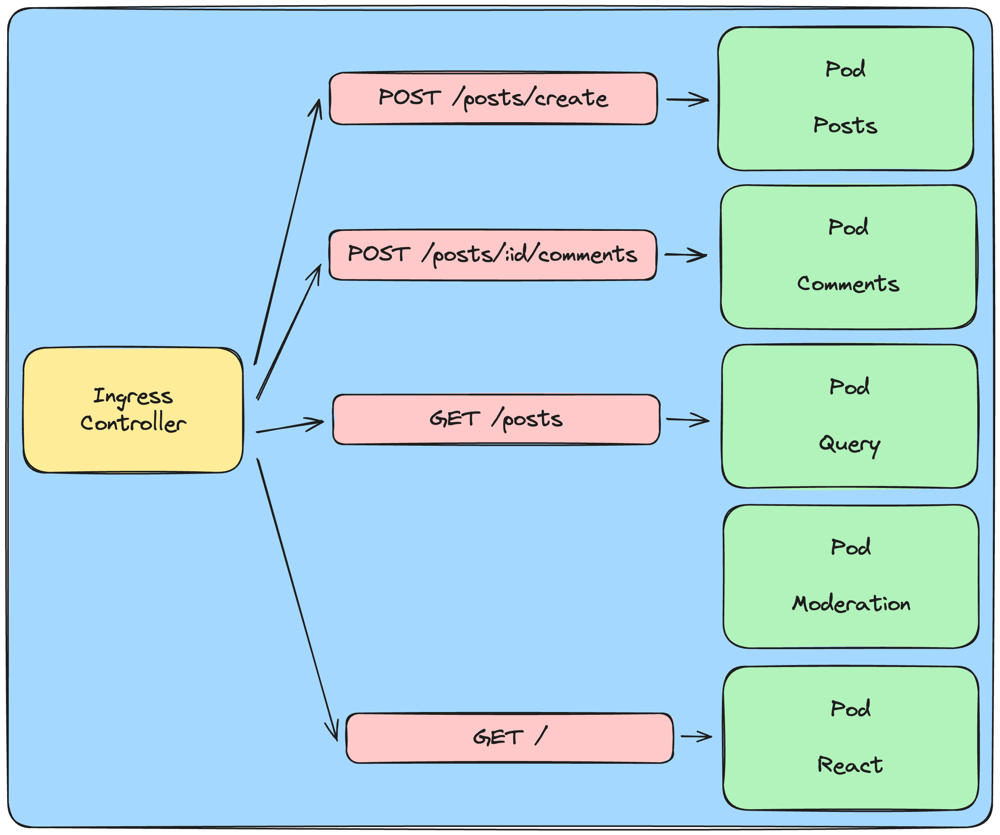

# Microservices Example

This is a simple application that was built using event-based microservices.

## Architecture

## Deployment

If you have a k8s cluster running and you want to update a specific deplyoyment run `kubectl rollout restart deployment [DEPL_NAME]`.

## Development

_Prerequisits: You need to have **docker**, **kubernetes** and **skaffold** installed._

To startup dev environment type `skaffold dev` in the root directory of this project.
