# Money Mate

Money Mate is a user-friendly personal finance manager designed to empower young individuals embarking on their independent living journey. With its intuitive interface and charming canine mascot, Money Mate helps users effortlessly track income, expenses, and savings on a weekly basis. Through insightful charts, users can visualize their spending patterns across different categories, fostering better financial habits and informed decision-making. Money Mate aims to be the loyal companion in managing personal finances, guiding users towards financial wellness and independence.

## Demo

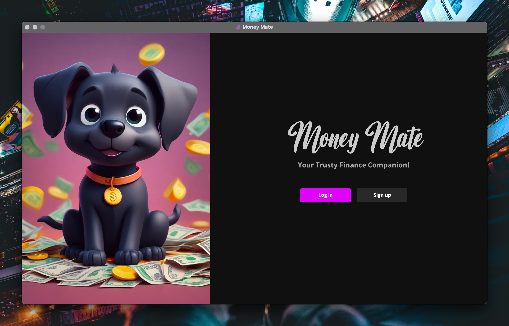
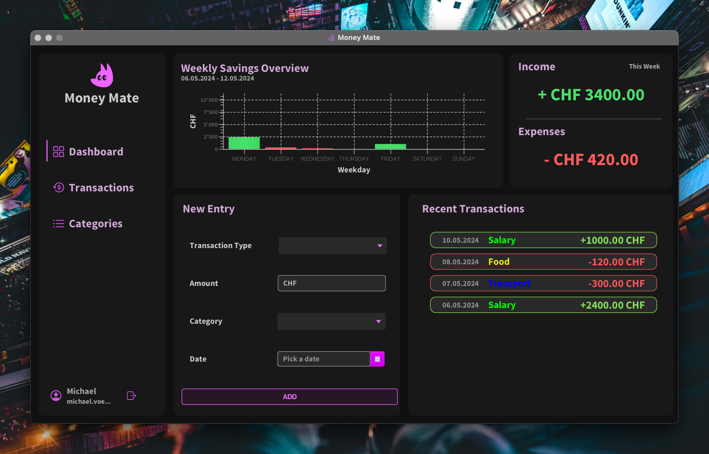
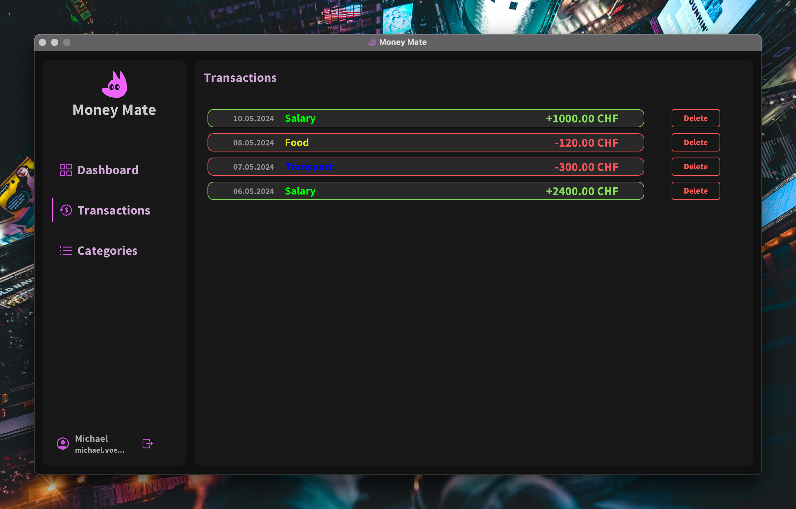
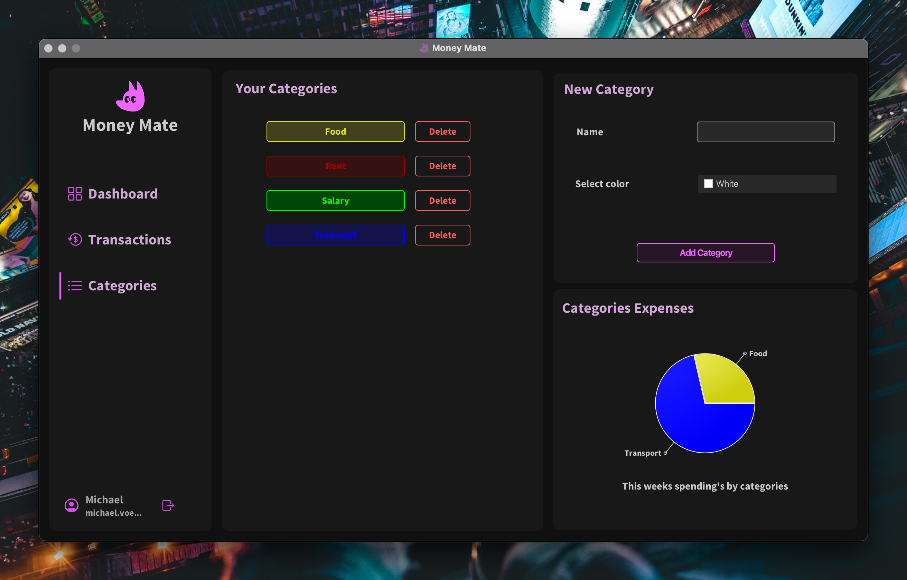

## Overview

- Track income, expenses, and savings weekly.
- Visualize spending patterns through insightful charts.
- Foster better financial habits and informed decision-making.

## Class Diagram

SVG: (Recommended)
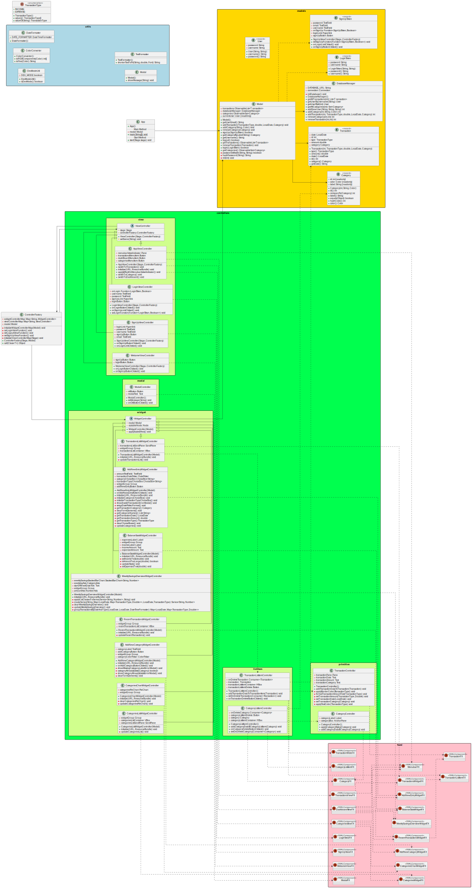

PNG: (Not recommended, since diagram is big)
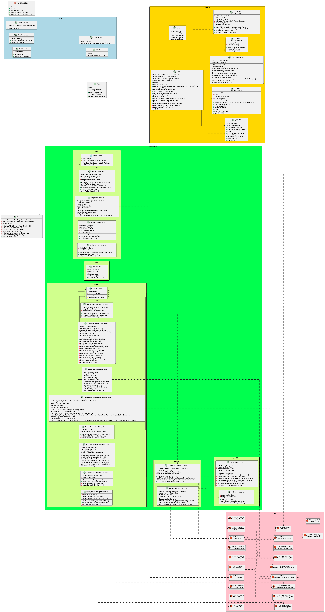

## ER Diagramm

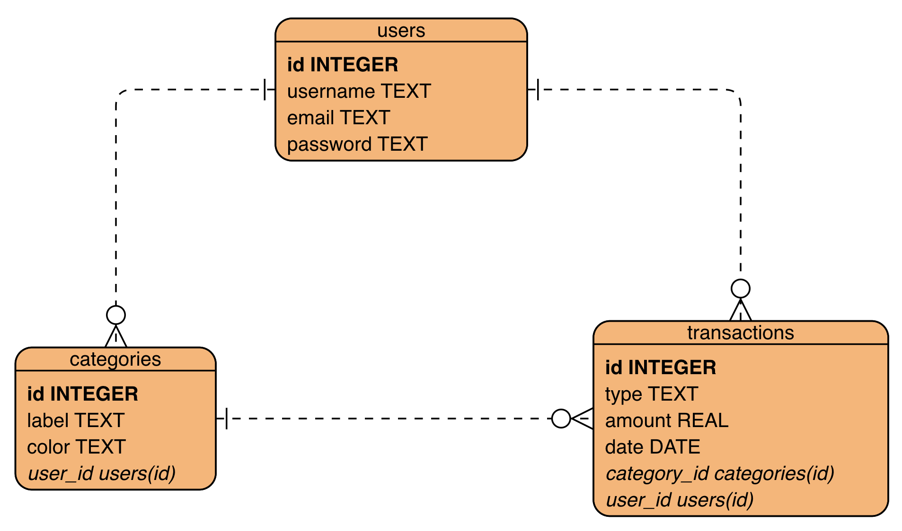

## Setup Instructions

1. Clone this repository to your local machine.
2. Ensure you have Java and Gradle installed.
3. Use Gradle to run the application:
   ```bash
   gradle run
   ```
   or
   ```bash
   ./gradlew run
   ```
   If you want to start up the application in the `development` mode, you can run:
   ```bash
   gradle dev
   ```
   or
   ```bash
   ./gradlew dev
   ```

## Project Structure

- **src/main**: Contains the main Java source code.
- **src/test**: Contains test cases for unit testing.
- **data.db**: Holds all the persistent data.

## Implementation Details

### Class Descriptions

The Money Mate application is built using the Model-View-Controller (MVC) design pattern.
Please refer to the [Class Descriptions](documentation/ClassDescriptions.md) for a detailed overview of the classes and their responsibilities.

### Design Guidelines

The Money Mate Guidelines are designed to be visually appealing and accessible.
These guidelines include the color palette, typography, and iconography used throughout the application.

[Design-Guidelines.md](docs/design-guidelines/Design-Guidelines.md)

### Color Palette

The Money Mate color palette is designed to be used consistently across the application to maintain a cohesive visual identity.

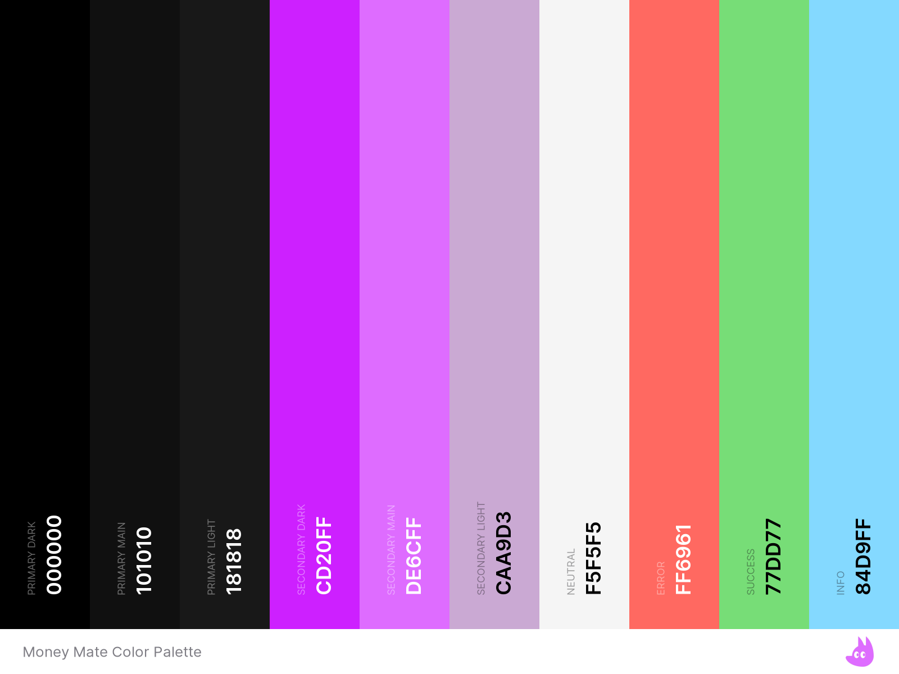

For a more comprehensive understanding, refer to the [Money Mate Color Palette Details](docs/design-guidelines/ColorPalette/MoneyMateColorPaletteDetails.pdf).

Please refer to the [Color Palette in Action](docs/design-guidelines/ColorPalette/MoneyMateColorPaletteOverview.png) to see the
color palette in action.

### Testing Concept

DOCX:
[Testing Concept](docs/testing-concept/testing-concept.docx)

XLSX:
[Testing Concept](docs/testing-concept/testing-concept.xlsx)

### Typography

- **Source Sans Pro**: Is the main font that is used throughout the application.
- **Vintage**: Is only used once on the welcome view.

### Mockups

**Start**
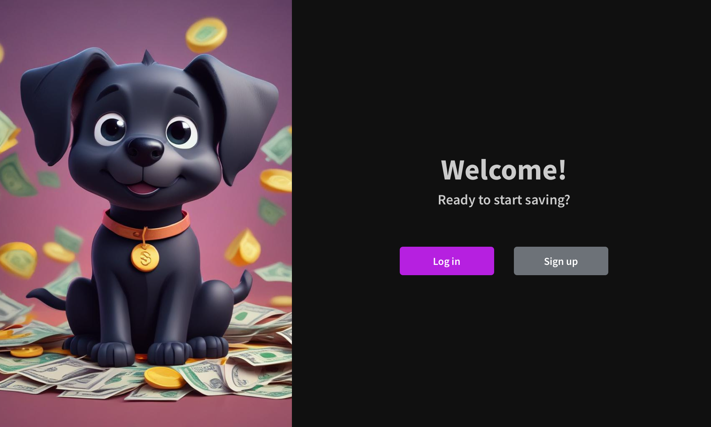
**Login**
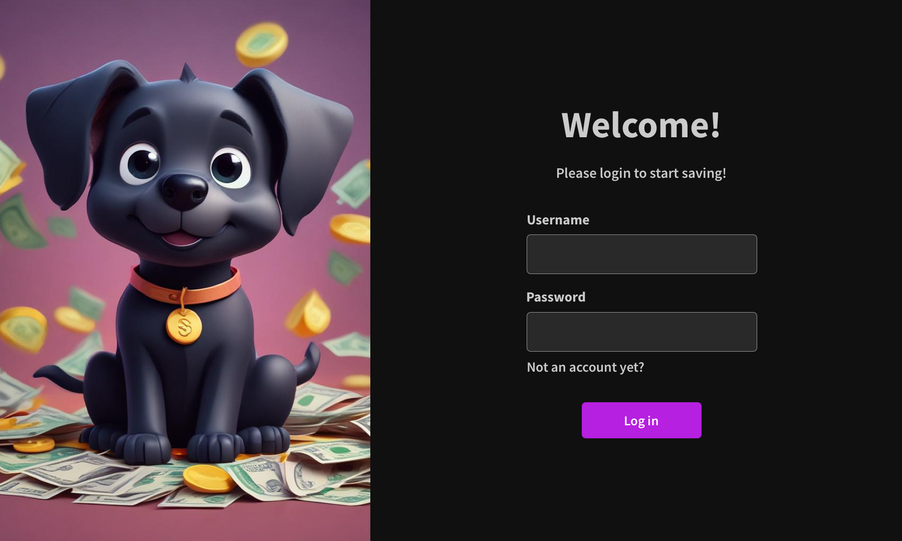
**SignUp**
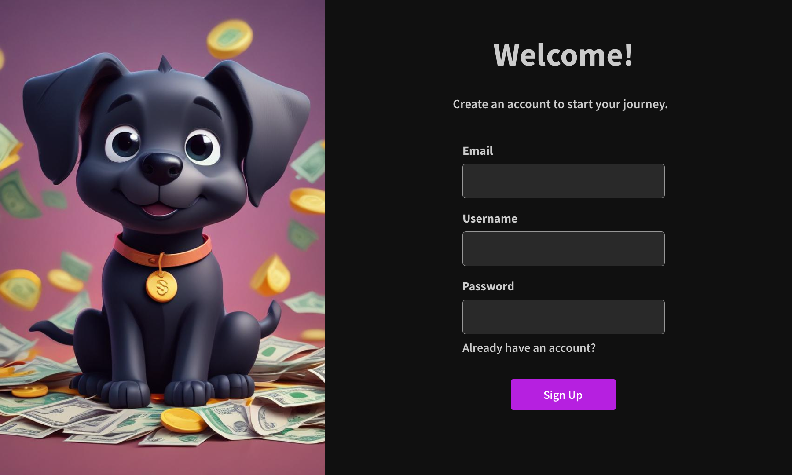
**Dashboard**
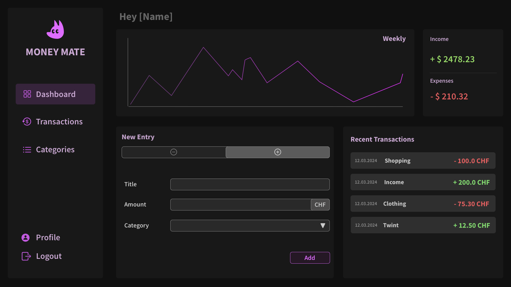
**Transactions**
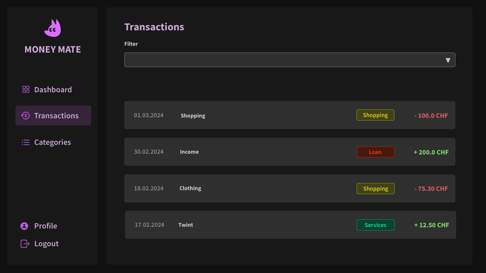
**Categories**
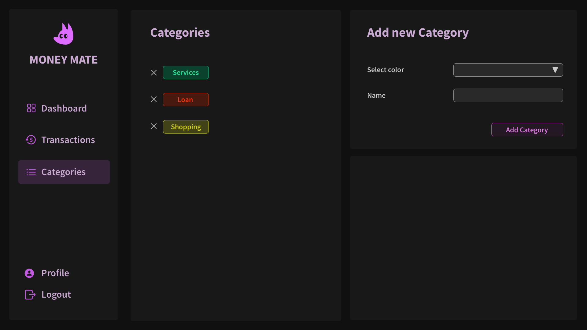

## License

This project is licensed under the [MIT License](LICENSE).
