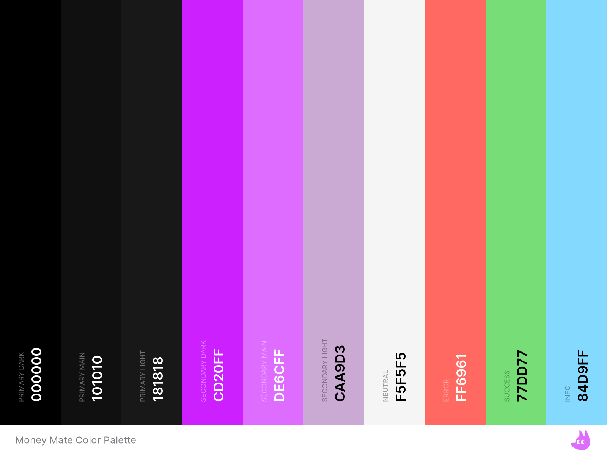

# Design Guidelines

## Color Palette 

The MoneyMate color palette is designed to be visually appealing and accessible. 
The primary colors are dark and light shades of grey, with a secondary color of purple for accents. 
The text color is white to ensure readability on the dark background. 
Alert and status colors are used to indicate different outcomes or states within the application. 
The color palette is designed to be used consistently across the application to maintain a cohesive visual identity.

For a more comprehensive understanding, refer to the [Money Mate Color Palette Details](ColorPalette/MoneyMateColorPaletteDetails.pdf).

## Color Variables

### Primary Colors
- `--primary-dark`: #000000 (Use sparingly for deep contrasts or accents)
- `--primary-main`: #101010 (Main background color of the application)
- `--primary-light`: #181818 (Use for floating component views/widgets)

### Secondary Colors
- `--secondary-dark`: #CD20FF
- `--secondary-main`: #DE6CFF (Use for accented icons and logo)
- `--secondary-light`: #CAA9D3 (Use for accented color titles of component views/widgets)

### Text Color
- `--text`: #F5F5F5 (Use for body text throughout the application)

### Alert and Status Colors
- `--error`: #FF6961 (Use for error messages or indicating negative outcomes)
- `--success`: #77DD77 (Use for success messages or indicating positive outcomes)
- `--info`: #84D9FF (Use for informative messages or highlights)

