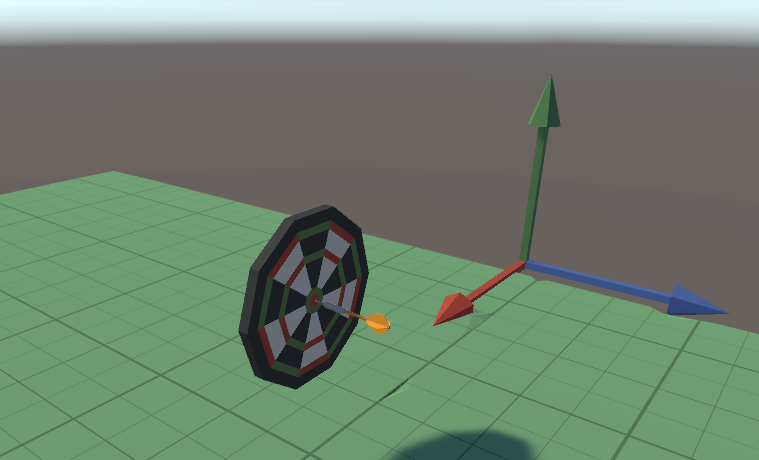
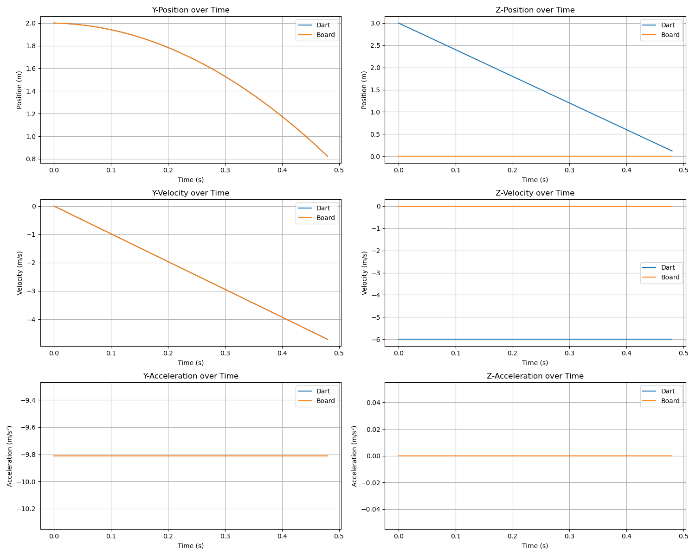

# Physics Engine - Dart

This is the report for the first part of the Physics Enigne project.

## 2. OrbitCamera

// TODO: skizze 1: koordinatensystem mit pitch und yaw
// TODO: skizze 2: wie kommt neue position der kamera zustande
// TODO: skizze 3: relevanten vektoren zwischen koordinatensystem, dartscheibe und kamera

The OrbitCamera script uses pitch and yaw angles to determine the camera's position around a target (the dartboard).

Pitch (rotation around X-axis) and Yaw (rotation around Y-axis) can be represented in two coordinate systems:

Pitch coordinate system:

X-axis: horizontal axis, positive to the right
Y-axis: vertical axis, positive upward
When pitch changes, the camera rotates up or down around the X-axis

Yaw coordinate system:

X-axis: horizontal axis, positive to the right
Y-axis: vertical axis, positive upward
When yaw changes, the camera rotates left or right around the Y-axis

The key line of code uses a quaternion rotation to position the camera:

```csharp
Quaternion rotation = Quaternion.Euler(pitch, yaw, 0);
Vector3 offset = rotation * new Vector3(0, 0, distance);
transform.position = targetInitialPosition + offset;
```

This works by:

Creating a rotation from the pitch and yaw angles
Applying that rotation to a vector (0, 0, distance) which points along the Z-axis
Adding the result to the target position

When the camera position changes based on these coordinates:

The camera is initially positioned at (0, 0, distance) relative to the target
The rotation transforms this position around the target based on pitch and yaw
The resulting position places the camera at the correct distance and orientation relative to the target
The camera always looks at the target position

## 3. Pfeil und Scheibe fallen zu Boden

// TODO: rework

Explanation of ForceMode.Force vs ForceMode.Acceleration:

ForceMode.Force: Applies a force taking mass into account (F = m \* a). The heavier the object, the less acceleration from the same force.
ForceMode.Acceleration: Applies acceleration directly, ignoring mass. All objects will accelerate at the same rate regardless of their mass.

Why the objects stand still before pressing the spacebar:
The objects initially don't move because rb.isKinematic = true is set in the Start() method for both scripts. When an object is kinematic:

- It's not affected by physics forces (including gravity)
- It doesn't respond to collisions in a physical way
- It can only be moved programmatically

Additionally, the useGravity property is likely set to false in the Unity Inspector for both objects, which would also prevent them from experiencing gravity even if they weren't kinematic.

## Final State



## Plot



## Authors

- Leonard Bödi (boedileo)
- Michael Voemel (voememic)
